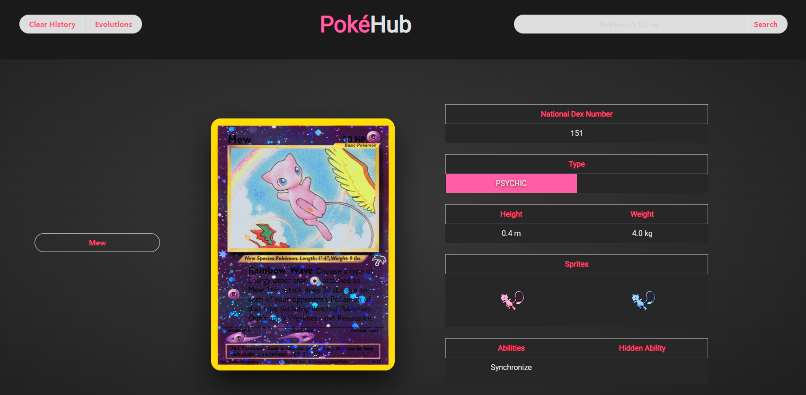

## PokéHub

https://noodle77.github.io/pokehub/

## Description

This is our group project for the PokéHub app that uses JQuery, Bulma, PokeAPI and PokemonTCGAPI. This project also features an evolutions modal created using Bulma. This project taught us how to work together to create different features and best practices for git and github. We were also able to learn about using multiple APIs within the same project to pull necessary data as we needed it to the page. We were also shown the advantages of a well documented API.

## Usage

The first time the app is loaded it will search for Mew by default to fill out the otherwise blank page. An input is in the top right of the page that allows the user to search for any pokémon by name. (NOTE: Not all pokémon is listed in the APIs especially Gen 8+.) When a valid pokémon has been searched the stats, an image of the card and the search history is populated within the middle of the page.

Back to the top on the left side the user should see "Clear History" and "Evolutions". Clear history allows the user to clear the page and reset back to a clean state. Evolutions allows the user to see if the searched pokémon has Evolutions to and from their current state. Not all pokémon has evolutions.

